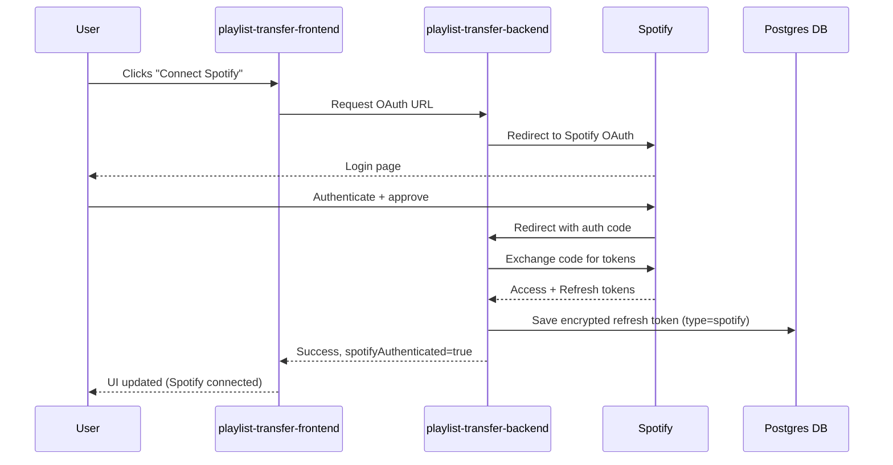
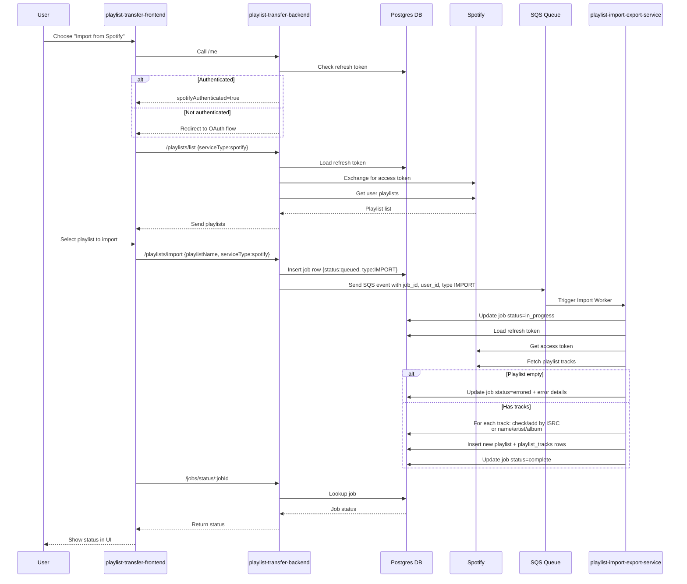
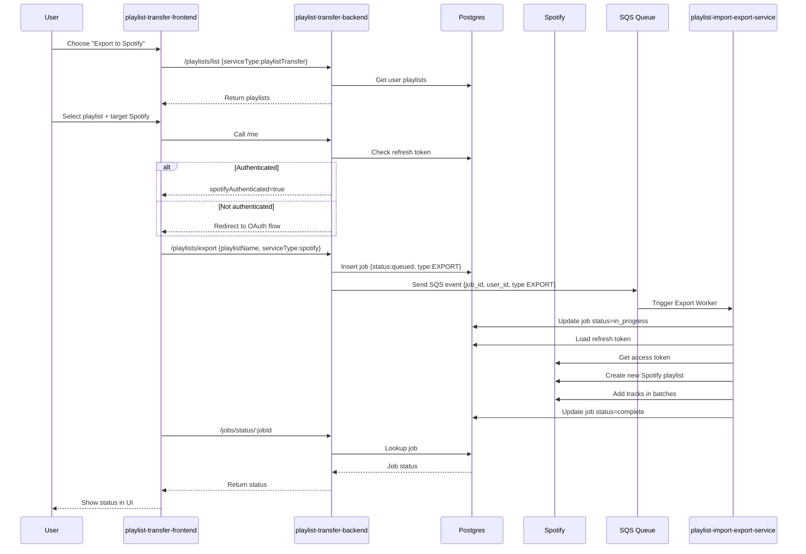

# Playlist Transfer Backend

[Try the website here!](https://playlist-transfer.milesbb.tech/)

This repository contains the **backend** for the Playlist Transfer website, built using **Node.js** and **Express**, deployed as an **AWS Lambda** function with **API Gateway**. The infrastructure is fully automated using **Infrastructure as Code (IaC)**, including **CodePipeline**, **CodeBuild**, **IAM**, **S3**, and **Lambda**. Packaging done with **webpack** and DB uses **PostgreSQL** and migrations done with **Flyway** that auto update in pipeline. Tests run with **Vitest**. Auth done with **JWT**, with additional security from **rate limiting**, and **hcaptcha**.

The project's main goal is to make it easy for people to archive and transfer their music playlists between apps/providers. Down with the walls between music providers!

This is part of a wider full-stack project, [check out the frontend here](https://github.com/milesbb/playlist-transfer-frontend) and [check out the python based playlist import/export service here](https://github.com/milesbb/playlist-import-export-service)!

---

## Table of Contents

- [Features](#features)
- [Architectural Flow Diagrams](#architectural-flow-diagrams)
- [Getting Started](#getting-started)
- [Project Structure](#project-structure)
- [Wanting to Contribute?](#wanting-to-contribute)

---

## Features

- Infrastructure-as-Code - No need to manually changeset/deploy `.yml` changes, they're picked up and automatically applied via pipeline on push
- All database migrations automatically update in pipeline (also plug-and-play database support via SSM)
- Node.js + Express API hosted on AWS Lambda
- Serverless API via API Gateway
- Automatic CI/CD with CodePipeline and CodeBuild
- Packaging with webpack both locally and in the cloud
- Full auth flow with JWT

**CI/CD Flow:**

1. Developer pushes code to repository
2. CodePipeline triggers CodeBuild
3. Any new migrations run on db via flyway and docker in CodeBuild
4. CodeBuild builds and packages any non `.yml` code changes and gives it to lambda
5. Any infrastructure `.yml` code changes are picked up and automatically changesetted and deployed in pipeline. Will fail on changeset if anything is wrong.

Results in quick turnaround for code changes being surfaced in API and infrastructure!

---

## Architectural Flow Diagrams

Below are the main architectural flows that describe how the system interacts across services.

If you're trying to view these locally on VSCode and it's not rendering, use [Markdown Preview Mermaid Support](https://marketplace.visualstudio.com/items?itemName=bierner.markdown-mermaid)

Check out the mentioned repositories here:

- [playlist-transfer-frontend](https://github.com/milesbb/playlist-transfer-frontend)
- [playlist-transfer-backend](https://github.com/milesbb/playlist-transfer-backend)
- [playlist-import-export-service](https://github.com/milesbb/playlist-import-export-service)

---

### 1. Third Party Music Service OAuth Flow (Spotify Example)



---

### 2. User Imports Playlist from Spotify



---

### 3. User Exports Playlist to Spotify



---

## Getting Started

### Prerequisites

- Node.js >= 18.x
- AWS CLI configured

```bash
npm install
```

To run locally

```bash
npm run start-offline-serverless
```

# Triggering the pipeline and updating the code and/or cloud resources

You can simply do this via pushing a commit.

```bash
git add .
git commit -m "Useful message" # avoid 'fixed x' or 'changed x'
git push origin main
```

All changes (including changes to `infrastructure.yml`, `buildspec.yml`, and `buildspec-migrate.yml`) will automatically update all relevant existing cloud resources.

You can check build logs in AWS codebuild.

# Manually Deploying/Changing AWS Resources

To manually deploy, run:

```bash
aws cloudformation deploy --template-file infrastructure.yml --stack-name PlaylistTransferStack --capabilities CAPABILITY_IAM CAPABILITY_NAMED_IAM --region eu-west-2
```

To manually changeset, run:

```bash
aws cloudformation create-change-set --stack-name PlaylistTransferStack --change-set-name {ADD NAME} --template-body file://infrastructure.yml --capabilities CAPABILITY_IAM CAPABILITY_NAMED_IAM --region eu-west-2
```

Check AWS after you changeset and review changes. If all happy, apply changeset and make sure it completes okay.

---

# Project Structure

Overall, try and follow this structure.

```bash
playlist-transfer-backend/
│
├─ src/
│   ├─ routes/         # Express route handlers
│   ├─ controllers/    # API entry/exit points
│   ├─ service/        # Business logic i.e. nothing data fetch-y or api-touchy
│   ├─ data/           # Database interactions
│   ├─ middlewares/    # Middleware functions
│   ├─ tests/          # Tests (mimics surrounding folder structure)
│   └─ lambda.ts       # Lambda entry point
│
├─ infrastructure.yml  # IaC template with pipeline, lambda, and other resources
├─ buildspec.yml       # CodeBuild build spec
├─ package.json
└─ README.md
```

# Wanting to Contribute?

This is not a super serious project and still in it's early infancy. In the future, I may begin to create small 'easy first issue' issues that people can pick up to get some experience working on a project. In general though feel free to comment on anything, always down to discuss and learn!

Feel free to also hit me up/learn more at [my website 'milesbb.tech'](https://milesbb.tech) or on [LinkedIn](https://www.linkedin.com/in/milesbaileybraendgaard/)!

# License

This project is licensed under the MIT License.
